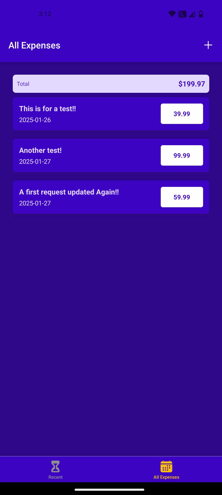
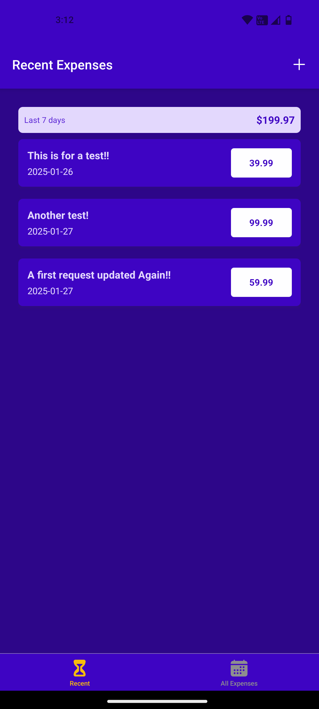
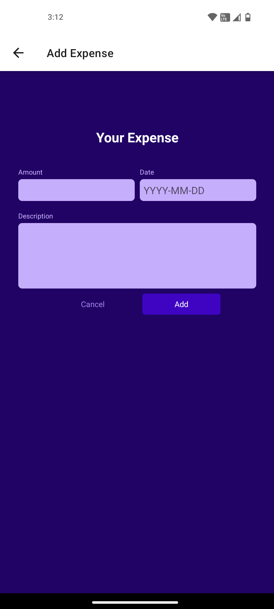
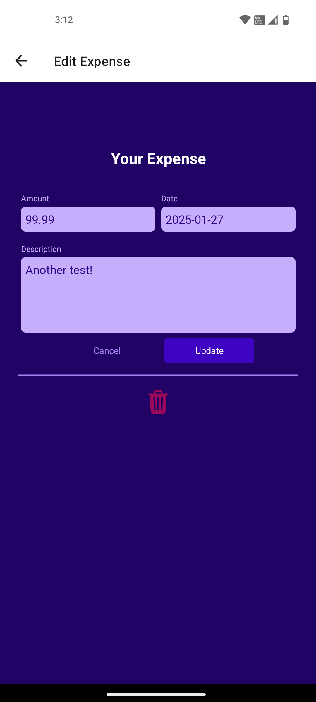

# Expense Tracker App

Expense Tracker is a mobile app developed with React Native and Firebase, designed to help users effectively manage their expenses. 
The app allows users to effortlessly add, update, and delete expense entries, as well as review their spending patterns on a weekly or all-time basis.

----------------------------------------------------------------------------------------------------------------------------------------------------------

  
  
  
  

